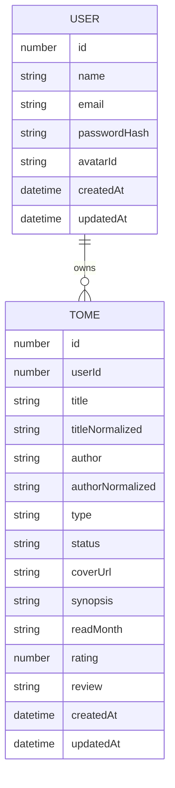
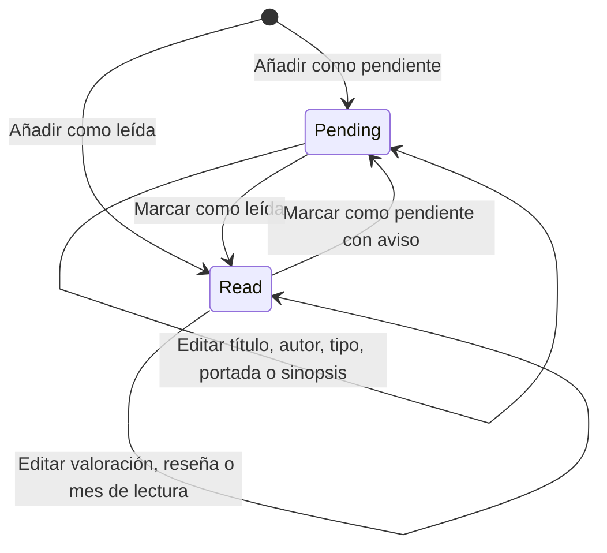
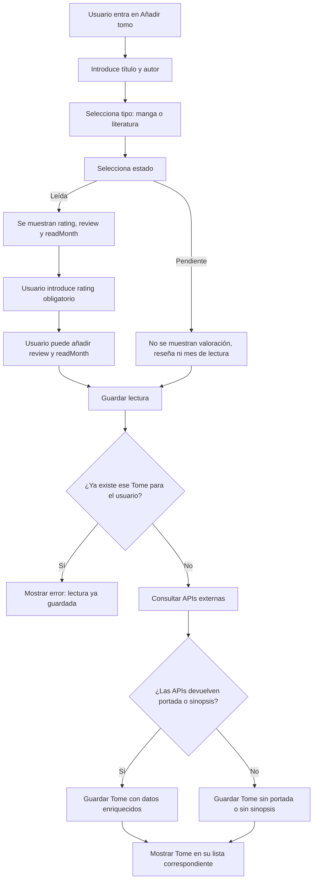

# Modelo de datos de TomoList

Aquí se recoge el diseño inicial del modelo de datos de TomoList.

La finalidad de este documento es dejar claras las entidades principales, sus campos, las reglas de negocio y los
diagramas necesarios antes de comenzar el desarrollo del backend.

TomoList es una app web de gestión personal de lecturas, en la que el usuario puede guardar lecturas de tipo manga o 
literatura, clasificarlas como pendientes o leídas, y registrar información personal como valoración, reseña y 
mes aproximado de lectura.

La aplicación también podrá consultar APIs externas, cuando estén disponibles, con fines de enriquecimiento 
aportando la sinopsis y la portada.

---

## 1.Entidad principal: Tome

Es la entidad central de la app web y representa las lecturas guardadas por el usuario independientemente del tipo.

Un `Tome` pertenece siempre a un usuario y representa una lectura concreta dentro de su biblioteca personal.

## 1.2.Modelo provisional de Tome

```ts
type Tome = {
    id: number
    userId: number

    title: string
    titleNormalized: string

    author: string
    authorNormalized: string

    type: 'manga' | 'literature'
    status: 'pending' | 'read'

    coverUrl?: string
    synopsis?: string

    readMonth?: string
    rating?: number
    review?: string

    createdAt: string
    updatedAt: string
}
```

## 1.3.Origen de los datos

### DATOS INTRODUCIDOS POR EL USUARIO

```txt
title
author
type
status
readMonth
rating
review
```

El usuario introduce manualmente los datos principales de la lectura. 
Si la lectura está marcada como leída, se desplegarán datos adicionales a introducir: `rating` será obligatorio
 y `review` y `readMonth` opcionales.

### DATOS OBTENIDOS DESDE APIs EXTERNAS
```txt
coverUrl
synopsis
```

Si las APIs no devuelven portada o sinopsis, la lectura debe poder guardarse igualmente.

### DATOS GENERADOS POR EL SISTEMA
```txt
id
userId
titleNormalized
authorNormalized
createdAt
updatedAt
```

Son identificadores, fechas de creación y actualización, y versiones normalizadas del título y del autor para evitar duplicados.

## 1.4.Reglas de negocio de Tome

### Regla 1: una lectura pertenece a un usuario
Cada `Tome` debe pertenecer a un único usuario. 
Un usuario puede tener muchas lecturas guardadas.    

### Regla 2: no se pueden repetir lecturas
Un mismo usuario no puede guardar dos veces la misma lectura.
Restricción lógica:
```txt
userId + titleNormalized + authorNormalized + type
```

### Regla 3: una lectura pendiente no tiene valoración, reseña ni mes de lectura
Al no haber sido leída, no debe tener esa información.
Restricción lógica:
```txt
si status = pending,
entonces rating = null, 
review = null
y readMonth = null
```

### Regla 4: una lectura leída exige valoración
Al cambiar estado o registrar la lectura como leída, el único dato obligatorio es `rating`.
Restricción lógica:
```txt
si status = read,
entonces rating != null.
```
`review`y `readMonth`son opcionales.


### Regla 5: cambiar una lectura de leída a pendiente elimina los datos del estado `read` de lectura
Eliminará definitivamente los datos:
```txt
rating
review
readMonth
```

Antes de aplicar el cambio se mostrará un aviso al usuario.

### Regla 6: el mes de lectura es orientativo
Permite dar una referencia aproximada del momento de la lectura. 
El formato será:
```txt
YYYY-MM
```

---

## 2.Diagrama entidad-relación inicial



Este diagrama representa la relación principal del sistema:

- Un usuario puede tener muchas lecturas guardadas.
- Cada `Tome` pertenece a un único usuario.

---

## 3.Diagrama de estados de Tome



Regla asociada al cambio de `read` a `pending`:

```txt
Si un Tome pasa de read a pending,
se eliminan rating, review y readMonth.
```

---

## 4.Flujo de añadir Tome



---

## 5.Flujo de cambio de estado

