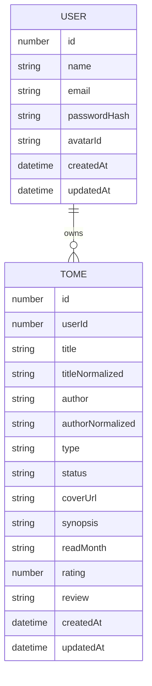
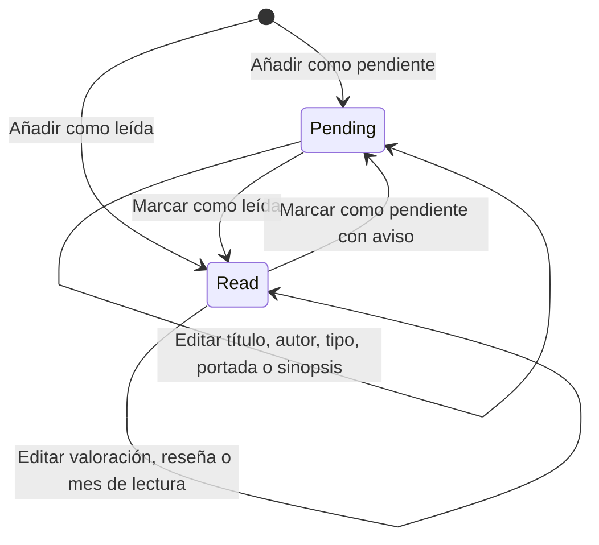
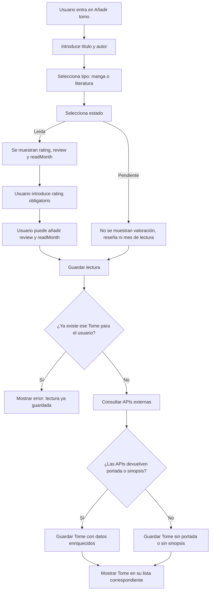

# Modelo de datos de TomoList

Aquí se recoge el diseño inicial del modelo de datos de TomoList.

La finalidad de este documento es dejar claras las entidades principales, sus campos, las reglas de negocio y los
diagramas necesarios antes de comenzar el desarrollo del backend.

TomoList es una app web de gestión personal de lecturas, en la que el usuario puede guardar lecturas de tipo manga o 
literatura, clasificarlas como pendientes o leídas, y registrar información personal como valoración, reseña y 
mes aproximado de lectura.

La aplicación también podrá consultar APIs externas, cuando estén disponibles, con fines de enriquecimiento 
aportando la sinopsis y la portada.

---

## 1.Entidad principal: Tome

Es la entidad central de la app web y representa las lecturas guardadas por el usuario independientemente del tipo.

Un `Tome` pertenece siempre a un usuario y representa una lectura concreta dentro de su biblioteca personal.

## 1.2.Modelo provisional de Tome

```ts
type Tome = {
    id: number
    userId: number

    title: string
    titleNormalized: string

    author: string
    authorNormalized: string

    type: 'manga' | 'literature'
    status: 'pending' | 'read'

    coverUrl?: string
    synopsis?: string

    readMonth?: string
    rating?: number
    review?: string

    createdAt: string
    updatedAt: string
}
```

## 1.3.Origen de los datos

### DATOS INTRODUCIDOS POR EL USUARIO

```txt
title
author
type
status
readMonth
rating
review
```

El usuario introduce manualmente los datos principales de la lectura. 
Si la lectura está marcada como leída, se desplegarán datos adicionales a introducir: `rating` será obligatorio
 y `review` y `readMonth` opcionales.

### DATOS OBTENIDOS DESDE APIs EXTERNAS
```txt
coverUrl
synopsis
```

Si las APIs no devuelven portada o sinopsis, la lectura debe poder guardarse igualmente.

### DATOS GENERADOS POR EL SISTEMA
```txt
id
userId
titleNormalized
authorNormalized
createdAt
updatedAt
```

Son identificadores, fechas de creación y actualización, y versiones normalizadas del título y del autor para evitar duplicados.

## 1.4.Reglas de negocio de Tome

### Regla 1: una lectura pertenece a un usuario
Cada `Tome` debe pertenecer a un único usuario. 
Un usuario puede tener muchas lecturas guardadas.    

### Regla 2: no se pueden repetir lecturas
Un mismo usuario no puede guardar dos veces la misma lectura.
Restricción lógica:
```txt
userId + titleNormalized + authorNormalized + type
```

### Regla 3: una lectura pendiente no tiene valoración, reseña ni mes de lectura
Al no haber sido leída, no debe tener esa información.
Restricción lógica:
```txt
si status = pending,
entonces rating = null, 
review = null
y readMonth = null
```

### Regla 4: una lectura leída exige valoración
Al cambiar estado o registrar la lectura como leída, el único dato obligatorio es `rating`.
Restricción lógica:
```txt
si status = read,
entonces rating != null.
```
`review`y `readMonth`son opcionales.


### Regla 5: cambiar una lectura de leída a pendiente elimina los datos del estado `read` de lectura
Eliminará definitivamente los datos:
```txt
rating
review
readMonth
```

Antes de aplicar el cambio se mostrará un aviso al usuario.

### Regla 6: el mes de lectura es orientativo
Permite dar una referencia aproximada del momento de la lectura. 
El formato será:
```txt
YYYY-MM
```

---

## 2.Diagrama entidad-relación inicial



Este diagrama representa la relación principal del sistema:

- Un usuario puede tener muchas lecturas guardadas.
- Cada `Tome` pertenece a un único usuario.

---

## 3.Diagrama de estados de Tome



Regla asociada al cambio de `read` a `pending`:

```txt
Si un Tome pasa de read a pending,
se eliminan rating, review y readMonth.
```

---

## 4.Flujo de añadir Tome



---

## 5.Flujo de cambio de estado


---

## 6.Entidad User

La entidad `User` representa a cada usuario registrado en TomoList. 
Cada usuario podrá iniciar sesión, gestionar su perfil, elegir un avatar predefinido y guadar sus propias lecturas.

## 6.1.Modelo provisional de User
```ts
type User = {
    id: number

    name: string
    email: string
    passwordHash: string

    avatarId: string

    createdAt: string
    updatedAt: string
}
```
## 6.2.Origen de los datos

### DATOS INTRODUCIDOS POR EL USUARIO
```txt
name
email
password
avatarId
```
Nombre, email y contraseña se introducen durante el registro. 
El avatar se podrá modificar desde la pantalla perfil una vez iniciada sesión.

### DATOS GENERADOS POR EL SISTEMA
```txt
id
passwordHash
createdAt
updatedAt
```
El sistema generará automáticamente estos datos y transformará la constraseña en `passwordHash`.

## 6.3.Reglas de negocio de User

### Regla 1: el email debe ser único
No pueden existir dos usuarios registrados con el mismo email.

### Regla 2: la contraseña se guarda hasheada
Las contraseñas no se pueden guardar directamente en texto plano por seguridad.
Se transforman en un hash seguro antes de guardarse.

### Regla 3: un usuario puede tener muchas lecturas
Un usuario puede guardar muchas lecturas. 
Relación lógica:
```txt
User 1 ---- N Tome
```

### Regla 4: avatar guardado en avatarId
El usuario podrá elegir un avatar entre los disponibles predefinidos.
La base de datos guardará solo el identificador del avatar.

---

## 7. Avatares predefinidos

TomoList usará avatares predefinidos que vivirán en el frontend y sus imágenes estarán una carpeta
públoca del proyecto. Estructura orientativa:
```txt
public/
└── avatars/
    ├── avatar-01.png
    ├── avatar-02.png
    ├── avatar-03.png
    └── avatar-04.png
```
En BD solo se guardará el identificador `avatarId` y con ello mostrará la imagen correspondiente.

---

## 8.Autenticación y sesión

TomoList tendrá un sistema de autenticación para permitir que cada usuario acceda únicamente a sus propias lecturas.
La sesión se gestionará desde el backend mediante una cookie segura.
El frontend no guardará tokens sensibles en `localStorage`.

## 8.1.Modelo provisional de sesión
```ts
type Session = {
    id: number
    userId: number

    sessionTokenHash: string

    createdAt: string
    expiresAt: string
    revokedAt?: string
}
```

## 8.2.Origen de los datos

### DATOS GENERADOS POR EL SISTEMA
```txt
id
userId
sessionTokenHash
createdAt
expiresAt
revokedAt
```

El sistema genera la sesión cuando el usuario inicia sesión correctamente.
El campo `sessionTokenHash` representa la versión hasheada del identificador seguro de la sesión.
La cookie será enviada por el backend al navegador y deberá configurarse como segura.

## 8.3.Reglas de negocio de sesión

### Regla 1: una sesión pertenece a un usuario
Cada sesión pertenece a un único usuario.
Un usuario puede tener varias sesiones activas si inicia sesión desde distintos dispositivos o navegadores.

### Regla 2: el frontend no almacena tokens sensibles
El frontend no debe guardar tokens de sesión en `localStorage`.
La sesión se gestionará mediante cookie segura configurada desde backend.

### Regla 3: una sesión debe poder expirar
Toda sesión debe tener una fecha de expiración.
Restricción lógica:
```txt
expiresAt != null
```
Una sesión solo será válida si no ha expirado y no ha sido revocada.
Condición de sesión válida:
```txt
expiresAt > fecha actual
revokedAt = null
```

### Regla 4: cerrar sesión invalida la sesión
Al cerrar sesión, la sesión debe quedar invalidada.
Restricción lógica:
```txt
revokedAt != null
```
Una sesión revocada no debe permitir acceder a rutas privadas.

---

## 9.Recuperación de contraseña

TomoList tendrá un flujo de recuperación de contraseña para usuarios que no recuerden su clave de acceso.
Este flujo se inicia desde la pantalla `ForgotPasswordPage`.

## 9.1.Modelo provisional de PasswordResetToken
```ts
type PasswordResetToken = {
    id: number
    userId: number

    tokenHash: string

    createdAt: string
    expiresAt: string
    usedAt?: string
}
```

## 9.2.Origen de los datos

### DATOS GENERADOS POR EL SISTEMA
```txt
id
userId
tokenHash
createdAt
expiresAt
usedAt
```

El sistema genera un token temporal cuando el usuario solicita recuperar su contraseña y guarda su versión hasheada.
Ese token se usará para permitir crear una nueva contraseña dentro de un tiempo limitado.

## 9.3.Reglas de negocio de recuperación de contraseña

### Regla 1: el token pertenece a un usuario
Cada token de recuperación pertenece a un único usuario.

### Regla 2: el token debe expirar
El token de recuperación debe tener una fecha de expiración.
Restricción lógica:

```txt
expiresAt != null
```

### Regla 3: el token solo puede usarse una vez
Para poder usarse, el token debe cumplir:
```txt
expiresAt > fecha actual
usedAt = null
```
Después de usarse, debe quedar marcado como utilizado.
Restricción lógica:
```txt
usedAt != null
```

### Regla 4: una contraseña nueva sustituye a la anterior
Cuando el usuario crea una nueva contraseña, el sistema debe generar un nuevo `passwordHash`.
La contraseña anterior deja de ser válida.

### Regla 5: el token no debe revelar si un email existe
Cuando un usuario solicita recuperación de contraseña, la respuesta de la aplicación no debe revelar si el email está registrado o no.
Mensaje orientativo:
```txt
Si el email existe en TomoList, recibirás instrucciones para recuperar tu contraseña.
```
---