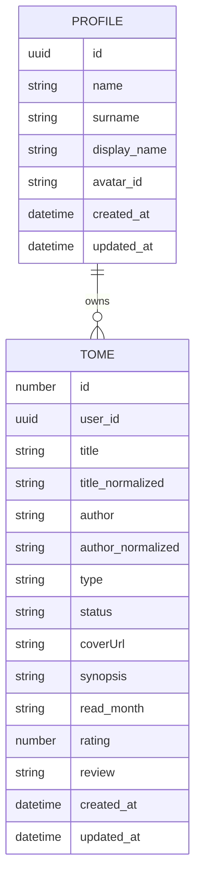
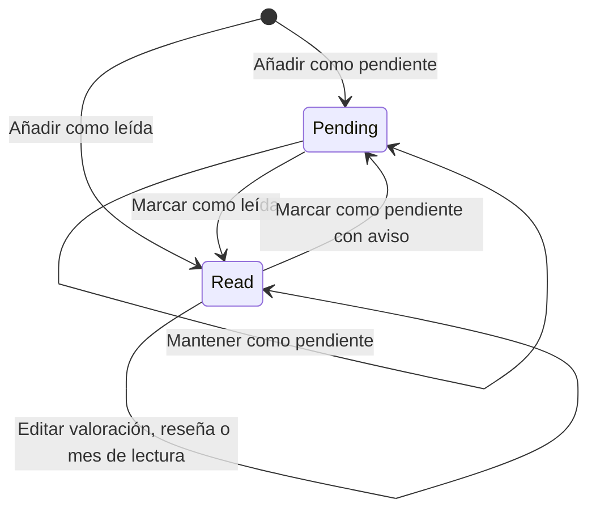
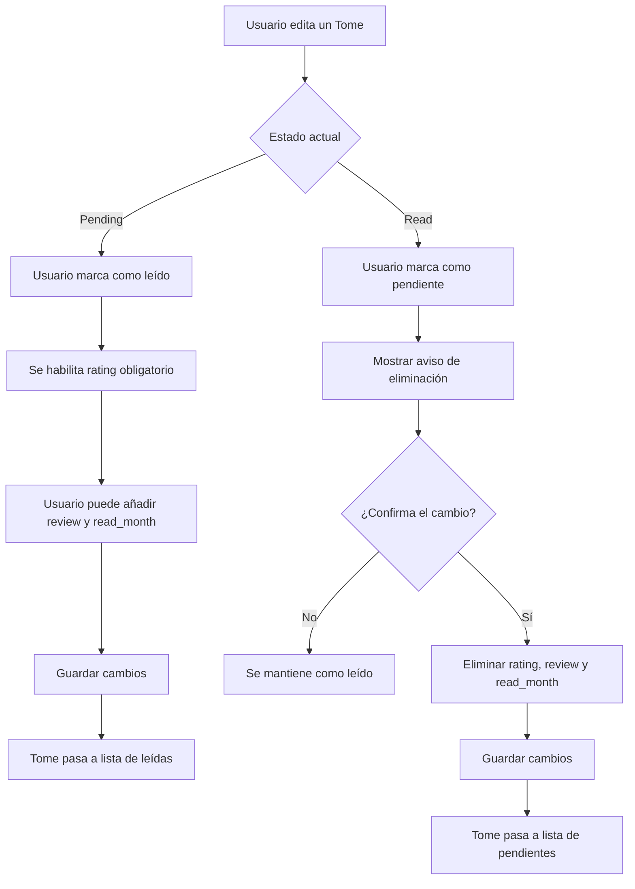

# Modelo de datos de TomoList

Aquí se recoge el diseño inicial del modelo de datos de TomoList.

La finalidad de este documento es dejar claras las entidades principales, sus campos, las reglas de negocio y los
diagramas necesarios para entender el modelo de datos del proyecto.

TomoList es una app web de gestión personal de lecturas, en la que el usuario puede guardar lecturas de tipo manga o 
literatura, clasificarlas como pendientes o leídas, y registrar información personal como valoración, reseña y 
mes aproximado de lectura.

La aplicación también consulta APIs externas, cuando estén disponibles, con fines de enriquecimiento 
aportando la sinopsis y la portada.

---

## 1.Entidad principal: Tome

Es la entidad central de la app web y representa las lecturas guardadas por cada ususari@ independientemente del tipo.

Un `Tome` pertenece siempre al usuari@ únic@ y representa una lectura concreta dentro de su biblioteca personal.

## 1.2.Modelo provisional de Tome

```ts
type Tome = {
    id: number
    user_id: number

    title: string
    title_normalized: string

    author: string
    author_normalized: string

    type: 'manga' | 'literature'
    status: 'pending' | 'read'

    coverUrl?: string
    synopsis?: string

    read_month?: string
    rating?: number
    review?: string

    created_at: string
    updated_at: string
}
```

## 1.3.Origen de los datos

### DATOS INTRODUCIDOS POR USER

```txt
title
author
type
status
readMonth
rating
review
```

La introducción de los datos principales de la lectura es manual mediante el formulario. 
Si la lectura está marcada como leída, se desplegarán datos adicionales a introducir: `rating` será obligatorio
 y `review` y `readMonth` opcionales.

### DATOS OBTENIDOS DESDE APIs EXTERNAS
```txt
coverUrl
synopsis
```

Si las APIs no devuelven portada o sinopsis, la lectura se guarda igualmente.

### DATOS GENERADOS POR EL SISTEMA
```txt
id
userId
title_normalized
author_normalized
created_at
updated_at
```

Son identificadores, fechas de creación y actualización, y versiones normalizadas del título y del autor para evitar duplicados.

## 1.4.Reglas de negocio de Tome

### Regla 1: una lectura pertenece a una única usuari@
Cada `Tome` debe pertenecer a una única usuari@. 
Una usuari@ puede tener muchas lecturas guardadas.    

### Regla 2: no se pueden repetir lecturas
Misma usuari@ no puede guardar dos veces la misma lectura.
Restricción lógica:
```txt
user_id + title_normalized + author_normalized + type
```

### Regla 3: una lectura pendiente no tiene valoración, reseña ni mes de lectura
Al no haber sido leída, no debe tener esa información.
Restricción lógica:
```txt
si status = pending,
entonces rating = null, 
review = null
y readMonth = null
```

### Regla 4: una lectura leída exige valoración
Al cambiar estado o registrar la lectura como leída, el único dato obligatorio es `rating`.
Restricción lógica:
```txt
si status = read,
entonces rating != null.
```
`review`y `read_month`son opcionales.


### Regla 5: cambiar una lectura de leída a pendiente elimina los datos del estado `read` de lectura
Eliminará definitivamente los datos:
```txt
rating
review
readMonth
```

Antes de aplicar el cambio se muestra un aviso.

### Regla 6: el mes de lectura es orientativo
Permite dar una referencia aproximada del momento de la lectura. 
El formato será:
```txt
YYYY-MM
```

---

## 2.Diagrama entidad-relación inicial



Este diagrama representa la relación principal del sistema:

- Un perfil puede tener muchas lecturas guardadas.
- Cada `Tome` pertenece a una única usuari@.
- La autenticación de usuari@ se gestiona mediante Supabase Auth.

---

## 3.Diagrama de estados de Tome



Regla asociada al cambio de `read` a `pending`:

```txt
Si un Tome pasa de read a pending, se eliminan rating, review y readMonth previo aviso.
```

---

## 4.Flujo de añadir Tome


---

## 5.Flujo de cambio de estado


---

## 6.Entidad Profile

La entidad `profile` representa los datos de perfil para cada usuari@ registrad@ en TomoList. 
Cada usuari@ puede iniciar y cerrar sesión, gestionar su perfil, elegir un avatar predefinido,
gestionar su biblioteca y consultar información de sus listas.

## 6.1.Modelo de Profile
```ts
type profile = {
    id: string

    name: string
    surname: string
    display_name: string
    avatarId: string

    createdAt: string
    updatedAt: string
}
```
## 6.2.Origen de los datos

### DATOS INTRODUCIDOS POR USER
```txt
name
surname
```
Nombre y apellidos se introducen durante el registro. 
El avatar y el nombre visible (`display_name`) se podrá modificar desde la pantalla "Mi perfil" una vez iniciada sesión.

### DATOS GENERADOS POR EL SISTEMA
```txt
id
display_name
avatar_id
created_at
updated_at
```
El campo `id` se corresponde con `user_id` autenticando en Supabase Auth.
El campo `display_name` inicializa con el valor del campo `name` y se puede editar posteriormente desde el perfil.
EL campo `avatar_id` guarda el identificador del avatar seleccionado en el perfil.

## 6.3.Reglas de negocio de User

### Regla 1: el perfil es único
Cada usuari@ registrado debe tener un perfil asociado.
Relación lógica:
    Supabase Auth user 1 ---- 1 profile

### Regla 2: email y contraseña pertenecen a Supabase Auth
Email, constraseña y user sesion no se guardan en `profiles`.

### Regla 3: cada usuari@ puede tener muchas lecturas
Una usuari@ puede guardar muchas lecturas. 
Relación lógica:
```txt
profile 1 ---- N Tome
```

### Regla 4: avatar guardado en avatar_id
Cada usuari@ podrá elegir un avatar entre los disponibles predefinidos.
La base de datos guardará solo el identificador del avatar seleccionado.

---

## 7. Avatares predefinidos

TomoList usará avatares predefinidos que vivirán en el frontend y sus imágenes estarán una carpeta
pública del proyecto. Estructura orientativa:
```txt
public/
└── avatars/
    ├── avatar-01.png
    ├── avatar-02.png
    ├── avatar-03.png
    ├── avatar-04.png
    ├── ...
    └── avatar-18.png
```
En BD solo se guardará el identificador `avatar_id` y con ello mostrará la imagen correspondiente.

---

## 8.Autenticación y sesión

TomoList usa Supabase Auth para gesrionar la utenticación y la sesión de usuari@s. Este sistema permite:
- registrarse
- iniciar/cerrar sesión
- mantener la sesión activa
- recuperar la contraseña

Al iniciar sesión, Supabase Auth mantiene la sesión activa en el navegador y a partir de aquí, la app
sabe si está autenticad@ o no y así consultar los datos asociados.


## 8.1.Modelo provisional de sesión

User autenticado se relaciona con las tablas propias del proyecto mediante su identificador.
En `profiles` el campo es `id` y en en `tomes` es `user_id`, así cada perfil y cada lectura quedan vinculados
al user autenticado correspondiente.


## 8.2.Reglas de negocio de sesión

### Regla 1: cada usuari@ accede solo a sus datos
Cada sesión pertenece a un id único accediendo así solo a su propio perfil y lecturas.

### Regla 2: la sesión identifica al usuari@ autenticad@
La sesión activa permite saber qué usuario está usando la aplicación y qué datos le pertenecen.

### Regla 3: cerrar sesión finaliza el acceso privado
Al cerrar sesión, se pierde el acceso a las rutas privadas de TomoList.

---

## 9.Recuperación de contraseña

TomoList usa Supabase Auth para gestionar la recuperación de contraseñas. Este flujo se inicia desde `ForgotPasswordPage`.
User introduce su email y Supabase Auth se encarga de enviar las instrucciones de recuperación de contraseña.

```
---